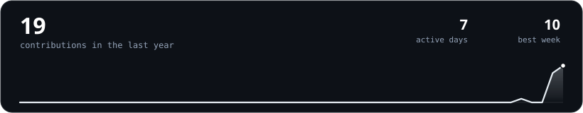

  

  <code>🕒 </code>

# `Michael Wang`

---

<a href="https://github.com/wamichae1"><b> GitHub</b></a> &nbsp;&nbsp;&nbsp;&nbsp;•&nbsp;&nbsp;&nbsp;&nbsp; <a href="https://linkedin.com/in/michael-wang"><b> LinkedIn</b></a> &nbsp;&nbsp;&nbsp;&nbsp;•&nbsp;&nbsp;&nbsp;&nbsp; <a href="https://michaelwang.dev/resume.pdf"><b> Resume</b></a> &nbsp;&nbsp;&nbsp;&nbsp;•&nbsp;&nbsp;&nbsp;&nbsp; <a href="https://michaelwang.dev"><b> Portfolio</b></a>

<table>
  <tr>
    <th width="100%" align="left">project</th>
  </tr>
  <tr>
    <td align="center">
      
    </td>
  </tr>
</table>

&nbsp;&nbsp;&nbsp;&nbsp;&nbsp;&nbsp;&nbsp;&nbsp;&nbsp;&nbsp;&nbsp;&nbsp;&nbsp;&nbsp;&nbsp;&nbsp;&nbsp;&nbsp;&nbsp;&nbsp;&nbsp;&nbsp;&nbsp;&nbsp;&nbsp;&nbsp;&nbsp;&nbsp;&nbsp;&nbsp;&nbsp;&nbsp;&nbsp;&nbsp;&nbsp;&nbsp;&nbsp;&nbsp;&nbsp;&nbsp;&nbsp;&nbsp;&nbsp;&nbsp;&nbsp;&nbsp;&nbsp;&nbsp;&nbsp;&nbsp;&nbsp;&nbsp;&nbsp;&nbsp;&nbsp;&nbsp;&nbsp;&nbsp;&nbsp;&nbsp;&nbsp;&nbsp;&nbsp;&nbsp;&nbsp;&nbsp;&nbsp;&nbsp;&nbsp;&nbsp;&nbsp;&nbsp;

---

