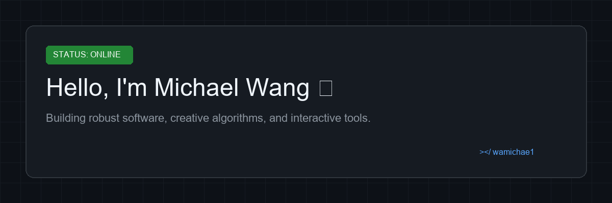

  

# Michael Wang (`wamichae1`)

  
  &nbsp;&nbsp;&nbsp;&nbsp;&nbsp;&nbsp;&nbsp;&nbsp;&nbsp;&nbsp;&nbsp;&nbsp;
  
  &nbsp;&nbsp;&nbsp;&nbsp;&nbsp;&nbsp;&nbsp;&nbsp;&nbsp;&nbsp;&nbsp;&nbsp;
  

---

## About Me

- Passionate software developer and algorithm enthusiast focused on building robust backend systems, clean interactive web applications, and efficient tooling.
- Experienced in Python, JavaScript, and modern web development architectures.
- Always exploring new ways to solve computational problems with elegant user experiences.

---

## Tech Stack & Skills

| Category | Technologies |
| :--- | :--- |
| **Languages** |     |
| **Tools & Platforms** |     |

---

## Featured Projects

| Project | Description & Architecture | Languages |
| :--- | :--- | :--- |
| **[SearchLabs](https://github.com/wamichae1/SearchLabs)** | Visualization of different search algorithms using Python. Implements and visualizes classic pathfinding and search algorithms with intuitive graphical interfaces, enabling clear comparative analysis of algorithmic efficiency. |   **100%** |
| **[Skytyper](https://github.com/wamichae1/Skytyper)** | Fun typing game. An engaging typing speed and accuracy game designed to make improving WPM fun and interactive through responsive client-server dynamics. |   **67.4%**   **32.6%** |
| **[FoneyPool](https://github.com/wamichae1/FoneyPool)** | 8 Ball Pool to enter your phone number. A creative and interactive web application merging casual pool gameplay with phone number input mechanics, demonstrating DOM manipulation and state management. |   **93.8%**   **5.7%**   **0.5%** |

---

## Engineering Principles

- **Modular Design:** Building decoupled, reusable components and clean module boundaries.
- **Performance & Efficiency:** Crafting optimized algorithms with clear time and space complexity considerations.
- **Maintainability:** Writing self-documenting code backed by robust documentation and automated CI/CD workflows.
